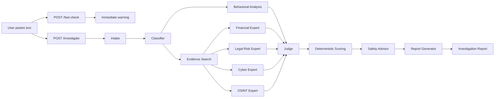

# 02 — MVP Architecture

## 1. Recommended stack

### Frontend

- React + TypeScript + Vite
- Tailwind CSS or a small custom CSS system
- Fetch/Axios
- No complex state library required

### Backend

- Python
- FastAPI
- Pydantic
- LangGraph for orchestration
- Provider adapters for LLM and search
- Pytest
- No database for the MVP

## 2. Repository structure

```text
vyvy/
├── AGENTS.md
├── README.md
├── .env.example
├── contracts/
│   ├── investigation_request.schema.json
│   └── investigation_response.schema.json
├── specs/
│   └── active/
│       └── mvp/
│           ├── proposal.md
│           ├── requirements.md
│           ├── design.md
│           ├── tasks.md
│           └── test-plan.md
├── backend/
│   ├── app/
│   │   ├── main.py
│   │   ├── api/
│   │   │   ├── routes_health.py
│   │   │   └── routes_investigation.py
│   │   ├── core/
│   │   │   ├── config.py
│   │   │   ├── logging.py
│   │   │   └── exceptions.py
│   │   ├── models/
│   │   │   ├── requests.py
│   │   │   ├── responses.py
│   │   │   └── state.py
│   │   ├── graph/
│   │   │   ├── builder.py
│   │   │   ├── nodes/
│   │   │   │   ├── intake.py
│   │   │   │   ├── classifier.py
│   │   │   │   ├── fast_check.py
│   │   │   │   ├── evidence.py
│   │   │   │   ├── experts.py
│   │   │   │   ├── behavior.py
│   │   │   │   ├── judge.py
│   │   │   │   ├── scoring.py
│   │   │   │   ├── safety.py
│   │   │   │   └── report.py
│   │   │   └── prompts/
│   │   ├── services/
│   │   │   ├── llm_provider.py
│   │   │   ├── search_provider.py
│   │   │   ├── source_scorer.py
│   │   │   └── mock_fixtures.py
│   │   └── utils/
│   │       ├── text.py
│   │       └── timing.py
│   ├── tests/
│   ├── requirements.txt
│   └── pyproject.toml
├── frontend/
│   ├── src/
│   │   ├── api/
│   │   ├── components/
│   │   ├── pages/
│   │   ├── types/
│   │   ├── data/
│   │   └── styles/
│   ├── package.json
│   └── vite.config.ts
├── scripts/
│   └── smoke_test.py
└── samples/
    └── demo_cases.md
```

## 3. Runtime flow



## 4. Why Fast Check is a separate endpoint

A separate endpoint is easier and more reliable than streaming during a one-day build.

Frontend flow:

1. User clicks Analyze.
2. Call `/fast-check`.
3. Show immediate warning.
4. Call `/investigate`.
5. Show progress steps.
6. Replace the loading state with the complete report.

This creates the perception of responsiveness while keeping the full workflow simple.

## 5. LangGraph state

Recommended state fields:

```python
class InvestigationState(TypedDict, total=False):
    investigation_id: str
    input_text: str
    locale: str
    intake: IntakeResult
    classification: ClassificationResult
    fast_check: FastCheckResult
    search_queries: list[str]
    evidence: list[EvidenceItem]
    evidence_status: EvidenceStatus
    expert_assessments: list[ExpertAssessment]
    behavioral_analysis: BehavioralAnalysis
    judge_result: JudgeResult
    verification: VerificationResult
    safety_advice: SafetyAdvice
    report: InvestigationReport
    warnings: list[str]
    timings_ms: dict[str, int]
```

## 6. Provider boundaries

### LLM Provider

Responsibilities:

- Send prompt.
- Request structured output.
- Validate response.
- Retry once.
- Return typed error.

### Search Provider

Responsibilities:

- Accept search query.
- Apply timeout.
- Normalize results.
- Never invent missing fields.
- Support mock fixtures.

### Source Scorer

Responsibilities:

- Score domain type.
- Score recency.
- Score official status.
- Score cross-source corroboration.
- Return an explainable score.

## 7. Concurrency

Run these concurrently:

- Financial Expert
- Legal Risk Expert
- Cyber Expert
- OSINT Expert

Behavioral analysis can run concurrently with evidence search because it uses the original text.

Do not run the Judge before all available expert results are collected.

## 8. Failure behavior

| Failure | Expected behavior |
|---|---|
| LLM timeout | Retry once, then return partial result |
| Search timeout | Continue text analysis, mark evidence unavailable |
| One expert fails | Judge uses remaining experts and lowers confidence |
| Invalid JSON | Repair once, then typed fallback |
| Empty input | `422` with a clear message |
| Very long input | Truncate safely or reject above configured limit |
| Mock Mode | Use fixed fixtures clearly labeled as demo data |

## 9. Minimal deployment

For the event:

- Frontend: Vercel or local laptop.
- Backend: Railway/Render or local laptop.
- Keep a local fallback.
- Store no user data.
- Use environment variables for all keys.
